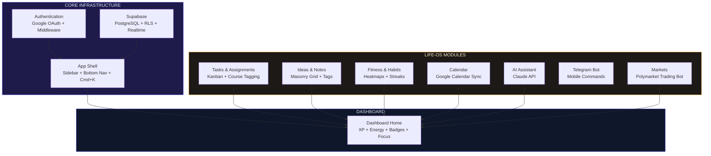
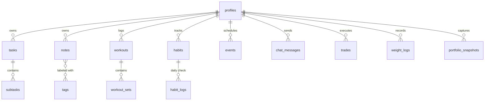

<div align="center">

# Life-OS

**A unified personal operating system for academics, fitness, habits, and productivity.**

[](https://nextjs.org/)
[](https://react.dev/)
[](https://www.typescriptlang.org/)
[](https://tailwindcss.com/)
[](https://supabase.com/)
[](https://vercel.com/)
[](https://github.com/sahnia3/life-os/actions/workflows/ci.yml)
[](LICENSE)

</div>

---

Life-OS replaces the fragmented mess of Notion, Google Calendar, fitness trackers, and note-taking apps with a single dashboard. The core premise is simple: your life data belongs in one place, where you can find correlations across domains. Does workout consistency affect academic performance? Do your most productive weeks correlate with better sleep? Life-OS makes those questions answerable.

---

## Module Roadmap

This is the system architecture -- eight modules, each owning a distinct domain of life data, all feeding into a unified dashboard.



| #   | Module                   | Description                                                | Status                                                                             |
| --- | ------------------------ | ---------------------------------------------------------- | ---------------------------------------------------------------------------------- |
| 1   | **Foundation**           | Auth, layout, database schema, Vercel deployment           |        |
| 2   | **Tasks & Assignments**  | Kanban board, course color-coding, subtasks, quick capture |  |
| 3   | **Ideas & Notes**        | Masonry grid, tag system, full-text search                 |          |
| 4   | **Fitness & Habits**     | Workout logging, weight tracking, heatmaps, streaks, goals |          |
| 5   | **Dashboard Home**       | Energy tracking, XP system, badges, daily focus mode       |          |
| 6   | **AI Assistant**         | Claude API integration for smart recommendations           |          |
| 7   | **Telegram Bot**         | Mobile `/commands` for quick task and habit updates        |          |
| 8   | **Calendar Integration** | Google Calendar sync, event management                     |          |

---

## What's Working Now

**Layout & Navigation**

- Collapsible sidebar with 7 navigation items and theme toggle
- Mobile-responsive bottom navigation bar
- Command palette triggered via `Cmd+K` / `Ctrl+K`
- Page transitions powered by Framer Motion
- PWA manifest -- installable as a native app

**Authentication**

- Google OAuth via Supabase Auth
- Middleware-level route protection with automatic redirect to `/login`
- Profile auto-creation on first sign-in (database trigger)

**Polymarket Trading Bot**

- Live trade history table with P&L calculations
- Portfolio performance charts (Recharts)
- Agent event streaming via Server-Sent Events (SSE)
- Agent organizational chart and run metrics

**Theming**

- Dark mode with smooth CSS transitions
- Indigo/Amber color system with CSS custom properties
- Geist font family via `next/font`

---

## Tech Stack

| Layer         | Technology                       | Purpose                                           |
| ------------- | -------------------------------- | ------------------------------------------------- |
| Framework     | Next.js 16.2 (App Router)        | Server/client components, API routes, middleware  |
| UI            | React 19.2 + TypeScript (strict) | Component architecture with full type safety      |
| Styling       | Tailwind CSS 4 + shadcn/ui       | Utility-first CSS with 25 pre-built components    |
| Animation     | Framer Motion 12.38              | Page transitions, staggered reveals, hover states |
| Database      | Supabase (PostgreSQL)            | Row-level security, real-time subscriptions       |
| Auth          | Supabase Auth (Google OAuth)     | Session management via `@supabase/ssr`            |
| Server State  | React Query                      | Cache invalidation, optimistic updates            |
| Client State  | Zustand                          | Sidebar collapse state, persisted to localStorage |
| Visualization | Recharts 3.8                     | P&L charts, fitness heatmaps, XP progress         |
| Deployment    | Vercel                           | Edge network, automatic preview deploys           |

---

## Design System

```
Primary     #4F46E5  Indigo       Actions, active states, links
Accent      #F59E0B  Amber        Highlights, warnings, streaks
Surface     --bg-surface           Card backgrounds, elevated panels
Border      --border-mid           Subtle separation, card edges
Text        --text-primary         High-contrast body text
Muted       --text-secondary       Labels, metadata, timestamps
```

Dark mode is the default. Light mode is supported but secondary. The interface uses the Geist font family with a monospace accent (`font-mono`) for status labels, timestamps, and numerical data.

---

## Database Schema

Seven migrations define the full data model. All tables enforce row-level security -- queries fail silently without an authenticated user context.



| Migration                  | Tables Created                                                    |
| -------------------------- | ----------------------------------------------------------------- |
| `00001_foundation.sql`     | `profiles` + auth trigger                                         |
| `00002_tasks.sql`          | `tasks`, `subtasks`                                               |
| `00003_notes.sql`          | `notes`, `tags`, join table                                       |
| `00004_fitness_habits.sql` | `weight_logs`, `workouts`, `workout_sets`, `habits`, `habit_logs` |
| `00005_calendar.sql`       | `events`                                                          |
| `00006_ai_chat.sql`        | `chat_messages`                                                   |
| `00007_markets.sql`        | `trades`, `analyses`, `portfolio_snapshots`                       |

---

## Gamification System

_Planned for Module 5 -- Dashboard Home._

The XP and leveling system is designed to create feedback loops between life domains:

| Mechanic       | Implementation                                                                      |
| -------------- | ----------------------------------------------------------------------------------- |
| **XP Sources** | Complete task (+10), finish workout (+15), maintain habit (+5), capture idea (+3)   |
| **Levels**     | 1--100, exponential XP curve (`level^2 * 100` XP per level)                         |
| **Badges**     | Milestone-based: 7-day streak, 100 XP day, first workout logged, 50 tasks completed |
| **Streaks**    | Daily habit completion tracked on a GitHub-style contribution heatmap               |
| **Energy**     | Self-reported 1--5 energy score, correlated against productivity metrics            |

---

## Getting Started

### Prerequisites

- Node.js 20+
- A [Supabase](https://supabase.com/) project (free tier works)
- Google OAuth credentials configured in Supabase Auth

### Setup

```bash
git clone https://github.com/sahnia3/life-os.git
cd life-os
npm install
```

Create `.env.local` from the example and fill in your Supabase credentials:

```bash
cp .env.example .env.local
```

```env
NEXT_PUBLIC_SUPABASE_URL=https://your-project.supabase.co
NEXT_PUBLIC_SUPABASE_ANON_KEY=your-anon-key
SUPABASE_SERVICE_ROLE_KEY=your-service-role-key

# Optional
ANTHROPIC_API_KEY=sk-ant-...
TELEGRAM_BOT_TOKEN=...
```

Apply database migrations and start the dev server:

```bash
npx supabase db push
npm run dev
```

The app will be running at `http://localhost:3000`.

### Running Tests

Tests are written with Vitest. Run the suite with:

```bash
npm test
```

---

<details>
<summary><strong>Project Structure</strong></summary>

```
life-os/
├── app/
│   ├── layout.tsx              # Root layout (Providers, AppShell, fonts)
│   ├── page.tsx                # Dashboard home
│   ├── tasks/page.tsx          # Kanban board
│   ├── ideas/page.tsx          # Notes masonry grid
│   ├── fitness/page.tsx        # Fitness tracking
│   ├── markets/page.tsx        # Trading bot dashboard
│   ├── calendar/page.tsx       # Calendar view
│   ├── assistant/page.tsx      # AI chat interface
│   ├── login/page.tsx          # Auth entry
│   └── api/
│       ├── agents/status/      # Agent run metrics
│       ├── agents/events/      # SSE event stream
│       └── trades/             # Trade data endpoint
├── components/
│   ├── layout/
│   │   ├── app-shell.tsx       # Sidebar + main area + page transitions
│   │   ├── sidebar.tsx         # Collapsible desktop navigation
│   │   ├── bottom-nav.tsx      # Mobile navigation bar
│   │   └── command-palette.tsx # Cmd+K search overlay
│   ├── markets/                # Trading-specific components
│   └── ui/                     # 25 shadcn/ui primitives
├── lib/
│   ├── supabase/
│   │   ├── client.ts           # Browser client (@supabase/ssr)
│   │   ├── server.ts           # Server client (cookies)
│   │   └── admin.ts            # Service role client
│   └── hooks/                  # Custom hooks (SSE streaming, etc.)
├── stores/
│   └── sidebar-store.ts        # Zustand, persisted to localStorage
├── supabase/
│   └── migrations/             # 7 SQL migration files
├── middleware.ts                # Auth guard with redirect
├── tailwind.config.ts
├── tsconfig.json
└── next.config.ts
```

</details>

---

## Roadmap

**Near-term** -- Complete the Tasks module with full Kanban functionality, subtask management, and course-based filtering. Build the Dashboard Home with energy tracking and the XP system.

**Mid-term** -- Ship the Ideas and Fitness modules. Implement the contribution heatmap, workout logging with set tracking, and the tag-based note organization system. Begin cross-domain analytics (fitness vs. productivity correlations).

**Long-term** -- Integrate Claude as an AI assistant that can query across all life data. Add the Telegram bot for mobile quick-capture. Sync Google Calendar events bidirectionally. Build the full gamification layer with badges, levels, and streak multipliers.

---

## License

[MIT](LICENSE)
